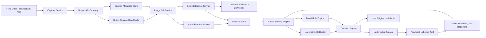
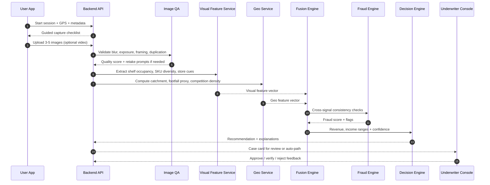
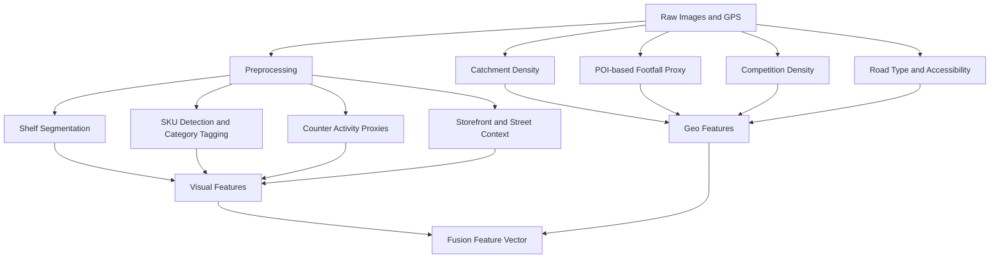
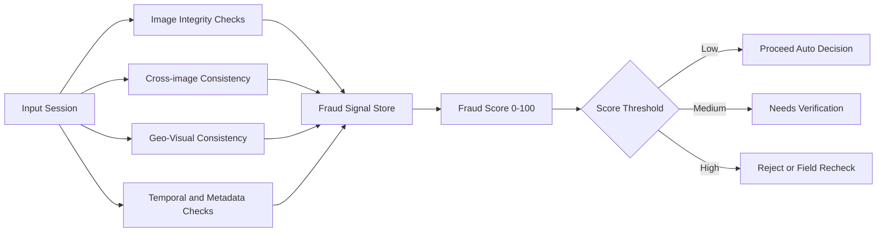
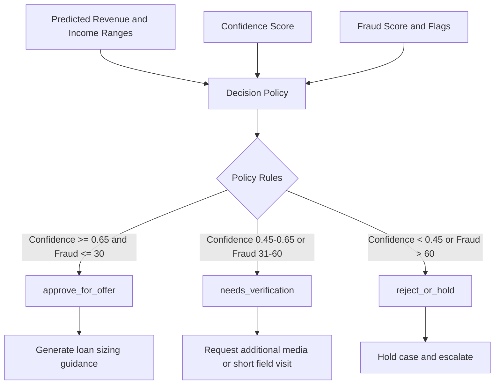
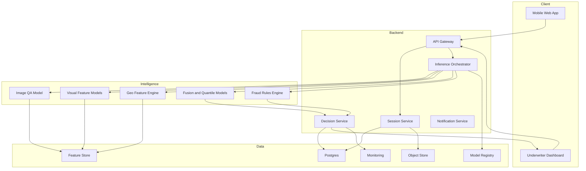
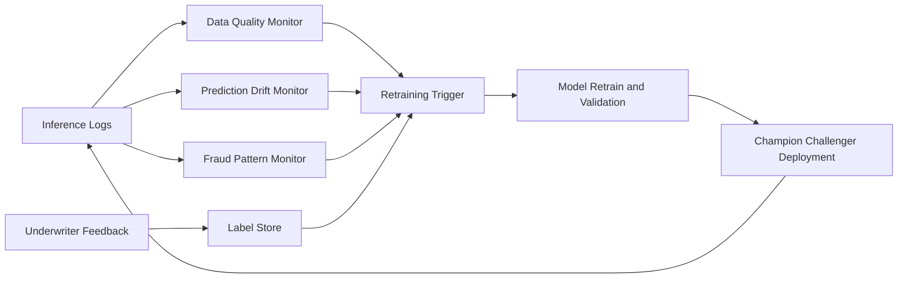

# Kirana Remote Cash-Flow Underwriting - Winning System Blueprint

## 1) Win Strategy (Judge Lens First)

### 1.1 What judges reward most
- Real NBFC deployability over research-heavy novelty.
- Honest uncertainty with ranges and confidence, not fake precision.
- Fraud and adversarial resilience (most teams miss this).
- Explainability that underwriting teams can trust.
- End-to-end flow with clear business action output.

### 1.2 Positioning statement
Build a credit-intelligence layer for kirana lending where images + geo signals produce explainable cash-flow bands, fraud flags, and action-ready underwriting recommendations in under 90 seconds.

### 1.3 Scope boundary for hackathon win
- In scope: image quality checks, visual+geo features, fusion model, uncertainty ranges, fraud scoring, decision recommendation, analyst view.
- Out of scope: heavy custom deep learning training from scratch, branch core-system integration, full production KYC stack.

---

## 2) Product Definition

### 2.1 Inputs
- Mandatory:
  - 3-5 smartphone photos: shelves, counter, storefront, street context.
  - GPS coordinates from device.
- Optional:
  - 5-10 second walkthrough video.
  - Declared shop size, rent, years in operation.

### 2.2 Outputs (all range based)
- Daily sales range (INR).
- Monthly revenue range (INR).
- Monthly normalized income range (INR).
- Confidence score (0-1).
- Risk flags list.
- Recommendation: approve_for_offer, needs_verification, reject_or_hold.

### 2.3 SLA targets
- Inference response time: <= 90 sec for 5 images.
- Minimum confidence threshold for auto decision path: >= 0.65.
- Manual verification fallback for low confidence or high fraud score.

---

## 3) Complete System Architecture



### 3.1 Layer responsibilities
- Capture layer: guided photo workflow with quality hints.
- Intelligence layer: extract visual and geo features.
- Decision layer: estimate ranges, confidence, fraud signals, recommendation.
- Learning layer: collect outcomes, monitor drift, retrain periodically.

---

## 4) End-to-End Workflow



---

## 5) Feature Engineering Blueprint



### 5.1 Core visual features
- Shelf Density Index: occupied shelf area / visible shelf area.
- SKU Diversity Score: distinct category clusters detected.
- Estimated Inventory Value Band: quantity x category price proxy.
- Refill Signal: partially empty shelves in high-demand categories.
- Storefront Commercial Signal: signage quality, openness, frontage cues.

### 5.2 Core geo features
- Catchment density index within 300m/500m radius.
- Footfall proxy from POIs: schools, bus stops, offices, clinics.
- Competition density: similar store count near location.
- Access index: road class + junction proximity.

---

## 6) Fusion, Estimation, and Uncertainty Design

### 6.1 Model strategy (hackathon-practical)
- Base model: gradient boosting regressor or lightgbm/xgboost on fused features.
- Target outputs:
  - log(daily_sales)
  - monthly_revenue
  - monthly_income
- Range generation:
  - Quantile models for p10 and p90.
  - Confidence score from data quality + model stability + fraud penalty.

### 6.2 Scoring equations (interpretable)
- revenue_point = f(visual_features, geo_features)
- revenue_low = quantile_10(revenue_point, uncertainty_factors)
- revenue_high = quantile_90(revenue_point, uncertainty_factors)
- income_range = revenue_range x margin_band
- final_confidence = w1*image_quality + w2*geo_completeness + w3*model_confidence - w4*fraud_penalty

### 6.3 Margin band logic
- Category mix determines assumed gross margin range.
- Example:
  - staples-heavy stores: lower margin band.
  - FMCG and personal care mix: higher margin band.

---

## 7) Fraud and Adversarial Defense (Critical Winning Section)



### 7.1 Fraud checks to implement immediately
- Duplicate-object pattern check across images (possible staged inventory).
- EXIF and timestamp inconsistency checks.
- Geo mismatch flag when storefront context does not match map density class.
- Coverage score: insufficient angles triggers low-confidence path.
- Inventory-footfall mismatch: very high stock in low-demand micro-market.

### 7.2 Risk flags examples
- limited_view_coverage
- inventory_footfall_mismatch
- suspicious_metadata_pattern
- high_competition_low_turnover_risk
- unusual_sku_distribution

---

## 8) Decision Policy Layer



### 8.1 Loan sizing guidance logic
- max_emi_ratio = min(policy_cap, affordability_from_income)
- eligible_loan_range derived from monthly_income_low, monthly_income_high, and tenor assumptions.

---

## 9) Data Contract and APIs

### 9.1 Inference request
```json
{
  "session_id": "KRN-2026-00123",
  "lat": 18.5204,
  "lng": 73.8567,
  "images": ["img1.jpg", "img2.jpg", "img3.jpg", "img4.jpg"],
  "optional": {
    "shop_size_sqft": 220,
    "monthly_rent": 18000,
    "years_in_operation": 4,
    "video": "walkthrough.mp4"
  }
}
```

### 9.2 Inference response
```json
{
  "daily_sales_range": [6200, 8900],
  "monthly_revenue_range": [186000, 267000],
  "monthly_income_range": [29000, 47000],
  "confidence_score": 0.74,
  "fraud_score": 28,
  "risk_flags": [
    "moderate_competition_density",
    "limited_counter_visibility"
  ],
  "top_value_drivers": [
    "high_shelf_density",
    "strong_poi_footfall",
    "good_sku_diversity"
  ],
  "recommendation": "approve_for_offer"
}
```

---

## 10) Underwriter Experience (UX That Wins)

### 10.1 Case card sections
- Predicted ranges panel with confidence meter.
- Fraud and verification panel.
- Explainability panel with top 5 positive/negative drivers.
- What-if simulator:
  - lower shelf density by 20%
  - high competition scenario
  - quality re-capture scenario
- Final action panel with one-click decision.

### 10.2 Why this is judge-friendly
- Makes AI operationally usable, not just a model output.
- Demonstrates transparency and governance in one screen.

---

## 11) Deployment Architecture (Hackathon to Pilot)



### 11.1 Recommended stack
- Frontend: Next.js or React + simple mobile-first capture UI.
- Backend: FastAPI or Node API.
- Models: Python services (PyTorch/TensorFlow optional, XGBoost for fusion).
- Data: Postgres + S3-compatible object store.
- Maps and POI: OpenStreetMap Overpass + optional Google Places fallback.

---

## 12) MLOps and Monitoring



### 12.1 Metrics to track
- Coverage pass rate (input quality).
- Confidence distribution shift by region.
- Manual override rate by decision class.
- Post-disbursement delinquency proxy by model band.
- Fraud flag precision and review outcomes.

---

## 13) Security, Privacy, and Governance

- Consent and purpose disclosure before capture.
- PII minimization: store only required metadata.
- Signed URL uploads, encrypted at rest.
- Role-based access for underwriters and admins.
- Audit trail for every score and decision event.
- Explainability snapshot stored with each case decision.

---

## 14) Demo Script for Finals (7-8 minutes)

1. Open app and capture guided photos for Shop A.
2. Show instant quality checks and retake prompt.
3. Submit and display prediction card with ranges and confidence.
4. Open explainability tab, show top drivers and risk flags.
5. Run what-if simulation and show impact.
6. Run Shop B with adversarial inputs and show fraud flags.
7. Show decisioning difference: approve vs needs verification.
8. Close with NBFC impact metrics and deployment feasibility.

---

## 15) Business Impact Model

### 15.1 NBFC value hypothesis
- 40-60% faster first-level underwriting for small-ticket kirana loans.
- Better risk segmentation versus pure field heuristics.
- Lower cost-to-acquire through remote pre-screening.

### 15.2 Hackathon impact assumptions
- If median underwriting turnaround drops from 2 days to <2 hours, conversion and customer satisfaction improve materially.

---

## 16) Judge-Facing One-Liner

We built a practical underwriting co-pilot where visual inventory proxies and geo-demand signals are fused into confidence-aware cash-flow bands, with fraud defense and policy-ready decisions that an NBFC can deploy with minimal process change.
